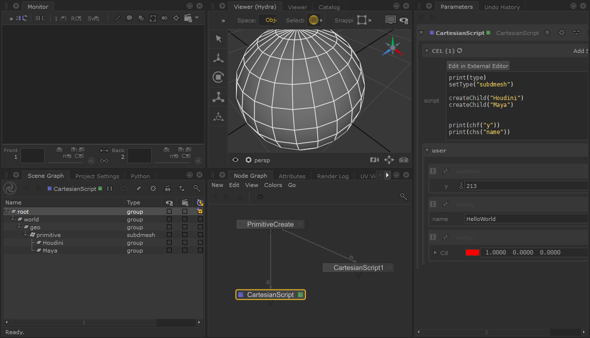

## OPENSOURCE LIBS:
* boost::dll
* boost::filesystem
* sol3 & luajit
* GLM
* CGAL


## CartesianLuajitCore
* it's a core
* plugins based
* compiled the luajit(static),boost::filesystem(static) ... all to the core
* so if you write app based on cartesian, just link cartesian, only include there headers

## CartesianPlugins
* write the plugin for Cartesian core
* if you want write plugin for cartesian,just try this:
```C++
#include "CartesianEntryPoint.h"
#include "sol.hpp"
#include <cmath>

void newOp(void *lua){
    auto *luaPtr = static_cast<sol::state *> (lua);
    luaPtr->set_function("sin",static_cast<float(*) (float)> (&sin));
    luaPtr->set_function("cos",static_cast<float(*) (float)> (&cos));
    luaPtr->set_function("acos",static_cast<float(*) (float)> (&acos));
    luaPtr->set_function("asin",static_cast<float(*) (float)> (&asin));
    luaPtr->set_function("pow",static_cast<double(*) (double,double)> (&pow));
    luaPtr->set_function("ceil",static_cast<double(*) (double)> (&ceil));
    luaPtr->set_function("floor",static_cast<double(*) (double)> (&floor));
}
```
* if you use katana, maya, houdini with cartesian this functions all for your platform

* binding GLM::mat* glm::vec*
* binding CGAL::surfacemesh


### KatanaCartesianJIT
* the whole new lua function for katana
* Similar to Houdini vex function, BUT NOW IT WAS BASED LUAJIT




## Sandbox
* only for test 
* application based Cartesian


## Write your own application based the cartesian
* 1, see the Sandbox cmakeslist.txt
* 2, link the CartesianLuajit.lib and the dll should in env PATH 


## LUAJIT SPEED
* Table is highly recommended
* But if you like. You can also use my exposed UserData, as you know, luajit doesn't optimize it
* Even though you still want to use it, try to use all the C++ functions I exposed.

## Build-IN Houdini VEX-Styles
> more functions check out:https://github.com/gearslogy/Cartesian/wiki/Cartesian-Functions

vector:

```lua
p1 = vector.new(1,1,1)                              -- OOP create a vector3
print("p1 lua:",p1.x, p1.y, p1.z)
p2 = vector.new(1,1,1)
p3 = p1 + p2;
p3 = p3 + 1;
print("p3 lua:",p3.x, p3.y, p3.z)
print(p3)
p4 = set(1,0,1)
print(p4)
print("-------------- cross ------------------")
print(cross(   {1,0,0},      {0,1,0})   )            -- cross(table,    table)
print(cross(   set(1,0,0),   {0,1,0})   )            -- cross(vector,   table)
print(cross(   vector.new(1,0,0),   {0,1,0})   )     -- cross(vector,   table)
print(cross(   {1,0,0}  ,set(0,1,0) ))               -- cross(table,   vector)

print('--------- normalize() ----------------')
print(normalize(1,2,0) )                             -- normalize(float,float,float) return vector
print(normalize({1,2,0}) )                           -- normalize(table) return vector
print(normalize(vector2.new(1,2)) )                  -- normalize(vector2) return vector2
print(normalize(vector.new(1,2,1)) )                 -- normalize(vector)  return vector
print(normalize(set(1,2,1) ) )                       -- normalize(vector)  return vector

print('------------length() --------------------')
print(length(set(0,2,0)) )
print(length({0,2,0}) )                          -- length a table vector

print('------------distance()-------------------')
print(distance(set(0,0,2), set(0,3,0) ));
print(distance({0,0,1},{0,1,0} ));

```


matrix:
```lua
print("-----create mat2 mat3 mat4 -------")
local mat2 = matrix2.new(1)
local mat3 = matrix3.new(1)
local mat4 = matrix.new(1)
print(mat2)
print(mat3)
print(mat4)

print('---------after change col=0 row=0----------')
setmatrix2(mat2,0,0,1000)
setmatrix3(mat3,0,0,1000)
setmatrix(mat4,0,0,1000)

print("-----mat2-----")
print(mat2)
print("-----mat3-----")
print(mat3)
print("-----mat4-----")
print(mat4)


print("----Inverse Matrix------")
local mat2_inverse = invert(mat2)
local mat3_inverse = invert(mat3)
local mat4_inverse = invert(mat4)
print(mat2_inverse)
print(mat3_inverse)
print(mat4_inverse)


print("--------- Gen Matrix Use vector----------------")
print(set( set(1,0),    set(0,1) )    )                    -------- matrix2
print(set( set(1,0,0),  set(0,1,0),  set(0,0,1) )   )      -------- matrix3 set() is a overload function
print(set({1,0},{0,1}))                                    -------- matrix2 with lua table
print(set({1,0,0},{0,1,0},{0,0,1}) )                       -------- matrix3 with lua table


print("-----Transform Matrix only support matrix4--------")
local mat4 = matrix.new(1.0)
mat4 = transform(mat4,set(0,1,0))
print(mat4)

print("-----Scale Matrix only support matrix4--------")
local mat4 = matrix.new(1.0)
mat4 = scale(mat4,set(0.5,0.5,0.2))
print(mat4)


print("-----Rotate Matrix only support matrix4--------")
local col1 = set(1,0,0,0)
local col2 = set(0,1,0,0)
local col3 = set(0,0,1,0)
local col4 = set(0,0,0,1)
local mat4 = set(col1,col2,col3,col4)    --- matrix4  --- also can create mat4 with : matrix.new(1.0) or matrix:new(1.0)
local mat4_rot = rotate(mat4,radians(60),set(0,1,0) )
print(mat4_rot)

print("-----Rotate Matrix only support matrix4,but use table--------")
local mat4_rot = rotate({1,0,0,0, 0,1,0,0, 0,0,1,0, 0,0,0,1},radians(60), {0,1,0})
print(mat4_rot)

print("--------------- astable() ------------------------")
local mat2 = set({1,0},{0,1})  ----if you write set(1,0,0,1), it will return vector4 type
print(mat2)
local mat2_astable = astable(mat2)              --- return lua table
print(mat2_astable[1],mat2_astable[2],mat2_astable[3],mat2_astable[4])

local mat3 = matrix3.new(1.0)
print(astable(mat3))
local mat4 = matrix.new(1.0)
print(astable(mat4))

```
* set() is a overload same as houdini


## Final
爱用不用
